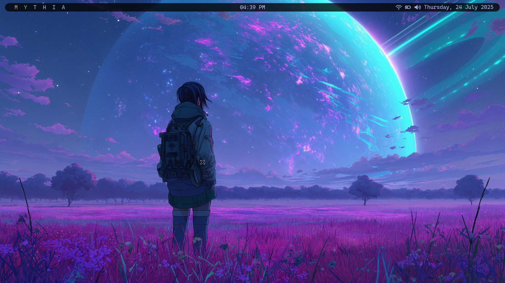
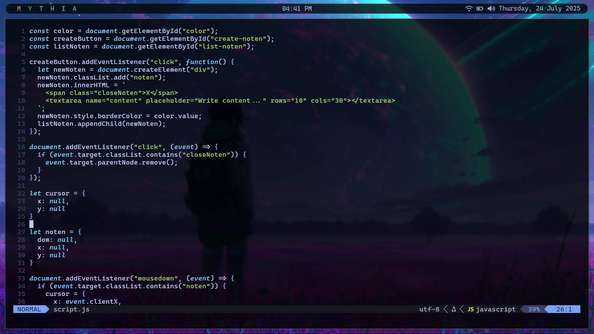

# dotfiles
my experience with linux

### Preview

### Neovim Preview

### NOTE

if you installing arch linux with minimal setup or manual way, don't forget to instal package "libcanberra" for kitty terminal bell sound.
and the touchpad config, see this site: https://wiki.archlinux.org/title/Touchpad_Synaptics
