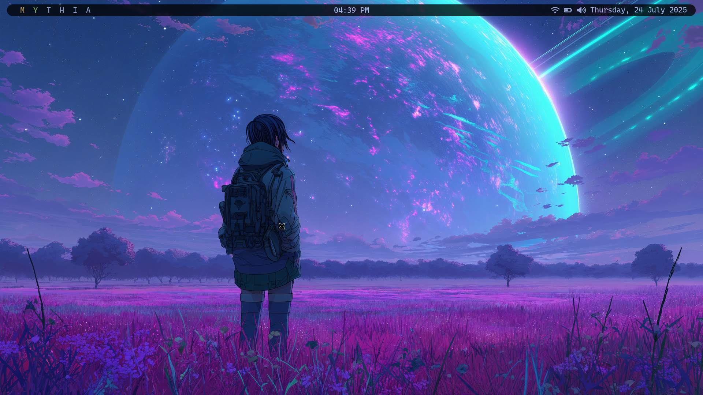
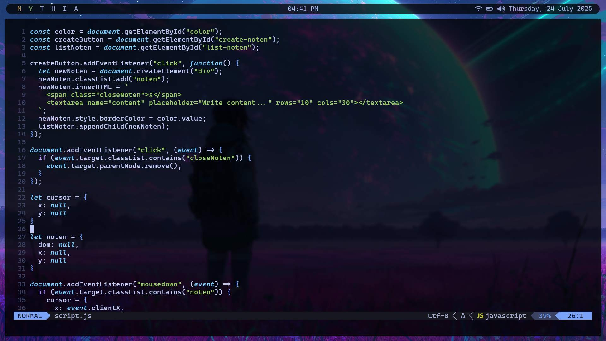

# dotfiles
Personal Linux setup notes, configurations, troubleshooting, and learning experiences.

### Preview

### Neovim Preview

### Note:
If you install Arch Linux using the minimal/manual setup method, don't forget to install the libcanberra package to enable the bell sound in Kitty terminal.
For touchpad configuration, refer to the documentation/site linked below.
https://wiki.archlinux.org/title/Touchpad_Synaptics
